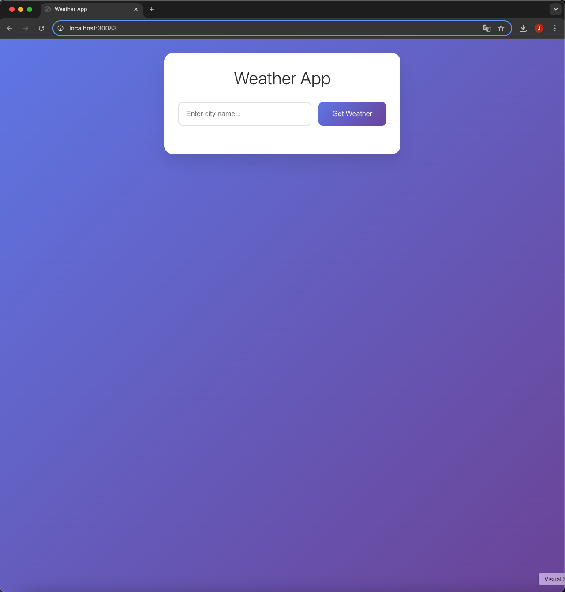
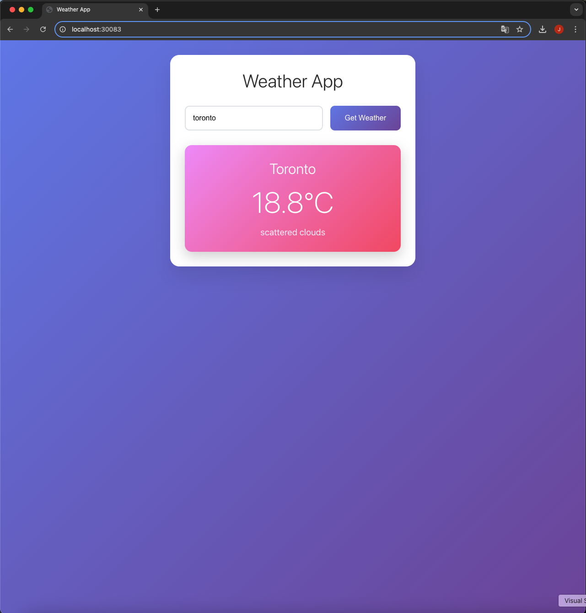

# Kubernetes Weather App

A Kubernetes Weather App that runs in a local free environment.

## Project Overview

The frontend is built with React to display weather information after city input, and the backend uses Node.js to call the OpenWeather API.
Both services are deployed to Kubernetes with separate Deployments and Services, accessible via NodePort from the browser.
Docker Hub is not used - images are built directly to Minikube's local Docker daemon and deployed immediately.

## Tech Stack

- **Frontend**: React + Vite
- **Backend**: Node.js + Express
- **Infrastructure**: Docker, Kubernetes, Minikube
- **External API**: OpenWeather (Current Weather Data, API Key required)

## Requirements

- When a city is entered in the frontend, it sends a request to the backend's `/api/weather?city=Seoul`.
- The backend calls the OpenWeather API and returns city name, temperature in Celsius, and weather description as JSON.
- CORS enabled.
- Frontend and backend are exposed via NodePort in Kubernetes:
  - Backend NodePort 30082
  - Frontend NodePort 30083
- OpenWeather API key is injected via Kubernetes Secret.
- Uses Minikube's Docker daemon to build images locally and deploy immediately.

## Project Structure

```
junbeom-sre-kubernetes-weather-project/
├── README.md
├── .gitignore
├── docs/
│   └── screenshots/
│       ├── Kubernetes_Weather_App_Screenshot_1.png
│       └── Kubernetes_Weather_App_Screenshot_2.png
├── backend/
│   ├── package.json
│   ├── server.js
│   └── Dockerfile
├── frontend/
│   ├── package.json
│   ├── vite.config.js
│   ├── public/
│   │   └── index.html
│   ├── src/
│   │   ├── App.jsx
│   │   ├── main.jsx
│   │   └── index.css
│   └── Dockerfile
└── k8s/
    ├── backend-deploy.yaml
    ├── backend-svc.yaml
    ├── frontend-deploy.yaml
    ├── frontend-svc.yaml
    └── secret-openweather.yaml
```

## Local Setup Guide (Minikube)

### 1. Start Minikube and Bind Docker Daemon

```bash
minikube start
eval $(minikube docker-env)
```

### 2. Build Backend Image

```bash
docker build -t weather-backend:1.0 ./backend
```

### 3. Build Frontend Image

Inject API address at build time. Configure for NodePort 30082 backend.

```bash
MINIKUBE_IP=$(minikube ip)
docker build \
  --build-arg VITE_API_BASE="http://$MINIKUBE_IP:30082" \
  -t weather-frontend:1.0 ./frontend
```

### 4. Create Secret

Modify the example file with actual values and apply.

```bash
# Change YOUR_OPENWEATHER_API_KEY to actual API key in secret-openweather.yaml
kubectl apply -f k8s/secret-openweather.yaml
```

### 5. Apply Manifests

```bash
kubectl apply -f k8s/backend-deploy.yaml
kubectl apply -f k8s/backend-svc.yaml
kubectl apply -f k8s/frontend-deploy.yaml
kubectl apply -f k8s/frontend-svc.yaml
```

### 6. Check Status

```bash
kubectl get pods -o wide
kubectl get svc
```

### 7. Access Application

#### Option 1: Port Forwarding (Recommended for localhost access)

```bash
# Terminal 1 - Frontend
kubectl port-forward service/weather-frontend-svc 30083:80

# Terminal 2 - Backend
kubectl port-forward service/weather-backend-svc 30082:8080
```

Then access:
- Frontend: http://localhost:30083
- Backend API: http://localhost:30082

#### Option 2: Direct NodePort Access

```bash
minikube ip
# Example: 192.168.49.2 then frontend is
# http://192.168.49.2:30083
```

## Verification

### Health Check

```bash
curl http://localhost:30082/api/health
# {"ok":true}
```

### Weather Query

```bash
curl "http://localhost:30082/api/weather?city=Toronto"
```

## Screenshots

### Main Application Interface


### Weather Results Display


## Troubleshooting Tips

### ImagePullBackOff
Possible that image wasn't built to Minikube Docker daemon
```bash
eval $(minikube docker-env) then rebuild docker build
```

### Frontend Network Error
Mismatch between VITE_API_BASE set at build time and current NodePort or IP
Rebuild frontend image

### 401 or 403
OpenWeather API key issue
Check secret value and restart backend deployment rollout
```bash
kubectl rollout restart deploy/weather-backend
```

### Port Forwarding Issues
If port forwarding doesn't work, restart the port forwarding commands:
```bash
# Kill existing port forwards
pkill -f "kubectl port-forward"

# Restart port forwarding
kubectl port-forward service/weather-frontend-svc 30083:80 &
kubectl port-forward service/weather-backend-svc 30082:8080 &
```

## API Endpoints

### Backend API

- `GET /api/health` - Health check endpoint
- `GET /api/weather?city={cityName}` - Get weather data for specified city

### Response Format

```json
{
  "city": "Toronto",
  "tempC": 18.7,
  "conditions": "broken clouds"
}
```

## Extension Ideas

- Ingress controller for domain routing
- HPA for backend autoscaling testing
- Runtime injection of frontend API base via Nginx environment variables
- Add weather forecast functionality
- Implement city search with autocomplete
- Add weather history and trends